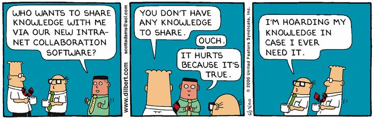

# Ways to handle unresponsive SMEs <!-- omit in toc -->

- [Introduction](#introduction)
- [Cooperation with SMEs essential for several reasons](#cooperation-with-smes-essential-for-several-reasons)
- [Some of the challenges of working with SMEs](#some-of-the-challenges-of-working-with-smes)
- [Ways of getting SMEs to work with us](#ways-of-getting-smes-to-work-with-us)

## Introduction
An unresponsive SME *(abbr. Subject Matter Expert)* can be a real challenge sometimes, especially when you are about to embark on a mission to start documenting complex products, services or systems. For less proficient folk, it is important to have someone to turn to when dealing with difficult stuff. For instance, an SME. The key here is cooperation with such a person. The question is thus, how important is it to cooperate with Subject Matter Experts or SMEs in IT?

## Cooperation with SMEs essential for several reasons 

The first one is the **expertise**. SMEs have a deep understanding of the specific area they specialize in. This expertise can help guide the IT team in developing solutions that are efficient, effective, and in line with industry standards.

Another one is **quality assurance**. SMEs can help ensure the quality of IT projects by providing their expert opinion and feedback. They can identify potential issues or improvements that may not be apparent to the IT team.

**Training and Support** are of no lesser importance. SMEs can provide training and support to the IT team, helping them understand the complexities of the subject matter. This can lead to better problem-solving and decision-making within the team.

Another aspect that plays an important role is **communication bridge**. SMEs can act as a bridge between the IT team and other stakeholders (like clients or other departments). They can help translate technical jargon into understandable terms, facilitating better communication.

Last but not least is **risk mitigation**. By involving SMEs, organizations can mitigate risks associated with a lack of knowledge or understanding of the subject matter. This can prevent costly mistakes and rework.

In conclusion, SMEs play a crucial role in IT projects, contributing to their success and efficiency. Their involvement can lead to better outcomes, higher quality, and increased satisfaction among all stakeholders.

While working with Subject Matter Experts (SMEs) can be highly beneficial, it can also present some challenges. 

## Some of the challenges of working with SMEs

First of all, **availability**. SMEs often have many responsibilities and may not always be available when needed for a project. This can lead to delays and communication gaps.

Also, **communication** can be an issue. SMEs are experts in their field and may use jargon or technical language that the IT team may not understand. This can lead to misunderstandings and miscommunications.

Another challenge, though maybe of not primary importance is **perspective**. SMEs may have a deep understanding of their subject matter, but they might lack a broader perspective. They might not fully understand the IT team’s constraints and challenges, which can lead to unrealistic expectations.

SMEs’ **resistance to change** can also be a potential constraint. SMEs are often very knowledgeable about their area of expertise and may be resistant to new ideas or approaches suggested by the IT team. This can lead to conflicts and slow down progress.

Not to be omitted is also **knowledge transfer**. It can be challenging to transfer the SME’s knowledge to the IT team effectively. The SME might struggle to articulate their knowledge in a way that the IT team can understand and apply.

Despite these challenges, the benefits of working with SMEs often outweigh the difficulties. Effective communication, mutual respect, and understanding can help mitigate these challenges.

The most important question when collaborating with SMEs on a specific project might be:

## Ways of getting SMEs to work with us

Motivating Subject Matter Experts (SMEs) in IT to cooperate can be achieved through several strategies:

-	**Recognition**: Acknowledge the expertise and contribution of the SMEs. Recognition can be a powerful motivator.

-	**Clear Communication**: Ensure that the SMEs understand the importance of their role and how their cooperation contributes to the success of the project.

-	**Involvement**: Involve SMEs in decision-making processes related to their area of expertise. This can make them feel valued and more willing to cooperate.

-	**Support**: Provide SMEs with the necessary resources and support to carry out their tasks effectively. This includes providing time, tools, and training if necessary.

-	**Building Relationships**: Foster a positive working relationship with SMEs. Show respect for their expertise, listen to their ideas, and be open to their feedback.

-	**Incentives**: If possible, provide incentives that are meaningful to the SMEs. This could be opportunities for professional development, financial rewards, or other benefits.

Remember, every individual is different, so it’s important to understand what motivates each SME and tailor your approach accordingly.
